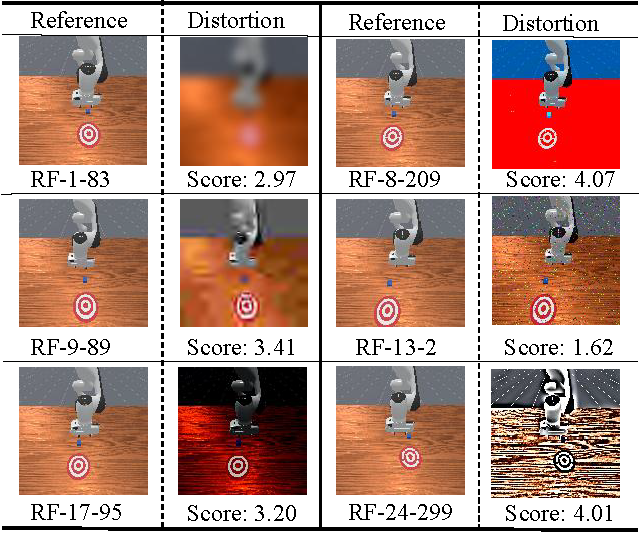

<div align="center">

 <h1>Embodied Image Quality Assessment for Robotic Intelligence

 The first embodied image quality assessment (EIQA) benchmark

 <div>
      <a href="https://scholar.google.com/citations?hl=en&user=Eru2-TYAAAAJ" target="_blank">Jianbo Zhang</a><sup>1</sup>,
      <a href="https://lcysyzxdxc.github.io" target="_blank">Chunyi Li</a><sup>1</sup>,
      <a href="" target="_blank">Liang Yuan</a><sup>1</sup><sup>*</sup>,
      <a href="" target="_blank">Guoquan Zheng</a><sup>2</sup>,
      <a href="" target="_blank">Jie Hao</a><sup>2</sup>,
      <a href="https://ee.sjtu.edu.cn/en/FacultyDetail.aspx?id=24&infoid=153&flag=153" target="_blank">Guangtao Zhai</a><sup>1</sup><sup>*</sup>,
 </div>

 <div>
  <sup>1</sup>Shanghai Jiaotong University,  <sup>2</sup>Beijing University of Chemical Technology.  <sup>*</sup>Corresponding author.
 </div> 
 
 <div style="width: 100%; text-align: center; margin:auto;">
      
 </div>
</div>

<div align="left">

**Why we do this?** Image quality assessment (IQA) of user-generated content (UGC) is a critical technique for human quality of experience (QoE). However, for robot-generated content (RGC), will its image quality be consistent with the Moravec paradox and counter to human common sense? Human subjective scoring is more based on the attractiveness of the image. Embodied agent are required to interact and perceive in the environment, and finally perform specific tasks. Visual images as inputs directly influence downstream tasks. In this paper, we first propose an embodied image quality assessment (EIQA) frameworks.

## Release
- [2024/12/26] 🔥 [Github repo](https://github.com/Jianbo-maker/EPD_benchmark) for **EPD-Bench** is online.
- [To Do] [ ] Expand richer data for datasets.

## EPD-Bench Construction
In contrast to traditional IQA image collection methods, embodied AI requires interaction with the surrounding environment. The ultimate goal is robot-oriented image quality assessment, and thus, image collection is also done by the robot itself. Two classical reinforcement learning algorithms, the Proximal Policy Optimization (PPO) and the Soft Actor Critic (SAC), and a state-of-the-art method, TDMPC2, are used to perform the 2 tasks in the **SAPIEN** simulator, respectively. A monocular camera is used to capture RGB images as sensor data input to the model.

Based on a simulated environment **ManiSkill**, a robotic arm acts as an embodied intelligence to perform simple push and pick tasks. For the robot, different quality of image inputs have different impacts on the robot to complete the task, which is also directly related to the performance of the robot.

## HVS & RVS are different
is a gap between the robot vision system and the human vision system, and the current image quality assessment from the human perspective is limited. 
<div style="width: 100%; text-align: center; margin:auto;">
  
</div>

## Evaluation
Comparison of 14 IQA methods for BL (Baseline), FR (Full Reference), NR (No reference) respectively on EPD benchmarks. For detail on differnet content types, please check our paper.
<div align=center>

 
| **Metric** | SRCC↑|  PLCC↑| KRCC↑| PUSH_SRCC↑| PUSH_PLCC↑| PUSH_KRCC↑| PICK_SRCC↑| PICK_PLCC↑| PICK_KRCC↑ |
| - | - | - | - | - | - | - | - | - | - | 
|PSNR| 0.1233| 0.1356| 0.0819| 0.0811| 0.0927| 0.0539| 0.0972| 0.1138| 0.0645|
|SSIM| 0.0597| 0.0635| 0.0396| 0.0633| 0.0716| 0.0417| 0.0228| 0.0275| 0.0152|
|PieAPP|0.3616| 0.3853| 0.2466| 0.1727| 0.2023| 0.1165| 0.1604| 0.1802| 0.1061|
|CKDN| 0.6971| 0.6654| 0.5062| 0.2100| 0.2186| 0.1404| 0.3372| 0.3040| 0.2266|
|IQT |0.5435| 0.5416| 0.3814| 0.3918| 0.3706| 0.2650| 0.5613| 0.5664| 0.3920|
|AHIQ| 0.4199| 0.4382| 0.2888| 0.2425| 0.2707| 0.1674| 0.3061| 0.3157| 0.2074|
|DISTS |0.2113 |0.2107| 0.1428| 0.1335| 0.1608| 0.0906| 0.1135| 0.1036| 0.0985|
|TOPIQ-FR| 0.1265| 0.1232| 0.0845| 0.1615| 0.1684| 0.1113| 0.1207| 0.1185| 0.0794|
|HyperIQA| 0.3212| 0.3289| 0.2212| 0.3099| 0.2981| 0.2098| 0.4055| 0.3927| 0.2733|
|DBCNN| 0.1921| 0.2133| 0.1307| 0.0962| 0.1039| 0.0643| 0.1882| 0.1855| 0.1251|
|MANIQA| 0.5267| 0.5603| 0.3675| 0.2475| 0.2574| 0.1661| 0.5847| 0.5859| 0.4116|
|CLIPIQA| 0.1821 |0.2160| 0.1218| 0.0750 |0.0893| 0.0503| 0.1464| 0.1497| 0.0978|
|TempQT| 0.2340| 0.1730| 0.1450| 0.1040| 0.0980| 0.0560| 0.2210| 0.1400| 0.1500|
|TOPIQ-NR| 0.1253| 0.1193| 0.0828| 0.0995| 0.1043| 0.0667| 0.0846| 0.0602| 0.0568|
</div>

**PUSH** means push box subset, and **PICK** means pick box subset.

## Contact

Please contact any of the first authors of this paper for queries.

- Jianbo Zhang, `sjtu5029101@sjtu.edu.cn@sjtu.edu.cn`

## Citation

If you find our work interesting, please feel free to cite our paper:

```bibtex
@misc{li2024cmcbench,
      title={Embodied Image Quality Assessment for Robotic Intelligence}, 
      author={Jianbo Zhang, Chunyi Li, Liang Yuan, Guoquan Zheng, Jie Hao, Guangtao Zhai},
      year={2024},
      eprint={2412.18774 },
      archivePrefix={arXiv}
}
```
